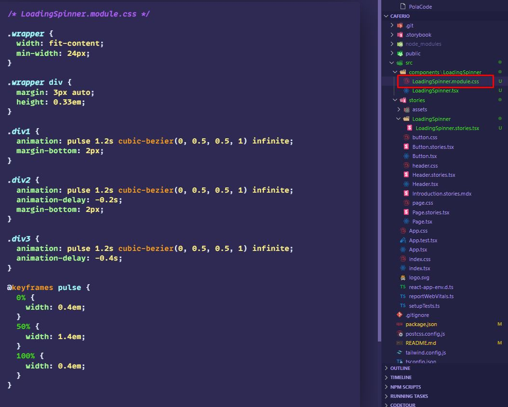
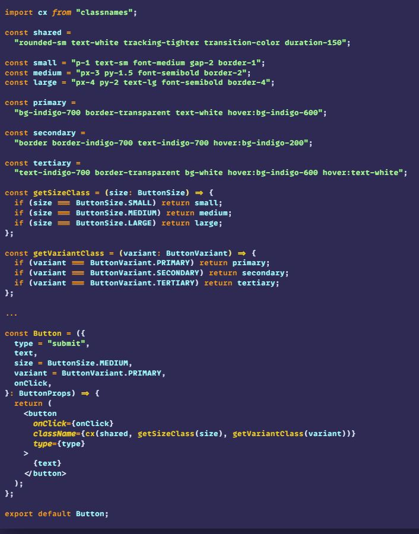

# Storybook with TailwindCSS+TS+React

### Creating a component

- Creating `src/components/nameOfComponent/nameOfComponent.tsx`
    - 
- Creating `src/components/nameOfComponent/nameOfComponent.module.css`
    - 
- Displaying the component within a story `src/stories/nameOfComponent/nameOfComponent.stories.tsx`
    - 
    - 


### Creating a component with tailwindcss
- Creating `Button` component
    - Store it in ...
        - `src/components/Button/Button.tsx`
    - What it should look like
        ```
        // Button.tsx
        
        export enum ButtonVariant {
          PRIMARY = "primary",
          SECONDARY = "secondary",
          TERTIARY = "tertiary",
        }
        
        export enum ButtonSize {
          SMALL = "small",
          MEDIUM = "medium",
          LARGE = "large",
        }
        
        export type ButtonProps = {
          type?: "submit" | "reset" | "button";
          text: string;
          variant: ButtonVariant;
          size?: ButtonSize;
          onClick?: () => void;
        };
        
        
        
        const Button = ({
          type = "submit",
          text,
          size = ButtonSize.MEDIUM,
          variant = ButtonVariant.PRIMARY,
          onClick,
        }: ButtonProps) => {
          return (
            <button onClick={onClick} type={type}>
              {text}
            </button>
          );
        };
        
        export default Button;
        ```
        - created types that will lay within `Button component`
        - `export default` the actual component
    - Add `tailwind` class and utilize `classnames` to dynamically change class' name
        - 
    - How it is displayed in `Storybook`
        - 
        - 
        - 
        - 
- Adding `Button` component to `Storybook`
    - Store file at...
        - `src/stories/Button/Button.stories.tsx`
    - What it should look like...
        ```
        import { ComponentMeta, Story } from "@storybook/react";
        import Button, {
          ButtonProps,
          ButtonSize,
          ButtonVariant,
        } from "../../components/Button/Button";
        
        export default {
          title: "Button",
          component: Button,
        } as ComponentMeta<typeof Button>;
        
        const Template: Story<ButtonProps> = (args) => <Button {...args} />;
        
        export const SmallPrimary = Template.bind({});
        SmallPrimary.args = {
          text: "Submit",
          variant: ButtonVariant.PRIMARY,
          size: ButtonSize.SMALL,
        };
        
        export const MediumPrimary = Template.bind({});
        MediumPrimary.args = {
          text: "Submit",
          variant: ButtonVariant.PRIMARY,
          size: ButtonSize.MEDIUM,
          type: "button",
        };
        
        export const MediumSecondary = Template.bind({});
        MediumSecondary.args = {
          text: "Submit",
          variant: ButtonVariant.SECONDARY,
          size: ButtonSize.MEDIUM,
          type: "button",
        };
        
        export const LargeTertiary = Template.bind({});
        LargeTertiary.args = {
          text: "Submit",
          variant: ButtonVariant.TERTIARY,
          size: ButtonSize.LARGE,
          type: "button",
        };
        
        
        export const All = () => {
          return (
            <div className="flex gap-6 items-start flex-col" style={{ width: "500px" }}>
              <div className="flex gap-2 items-start justify-between w-full">
                <Button
                  text={"Primary Small"}
                  variant={ButtonVariant.PRIMARY}
                  size={ButtonSize.SMALL}
                ></Button>
                <Button
                  text={"Primary Medium"}
                  variant={ButtonVariant.PRIMARY}
                  size={ButtonSize.MEDIUM}
                ></Button>
                <Button
                  text={"Primary Large"}
                  variant={ButtonVariant.PRIMARY}
                  size={ButtonSize.LARGE}
                ></Button>
              </div>
              <div className="flex gap-2 items-start justify-between w-full">
                <Button
                  text={"Secondary Small"}
                  variant={ButtonVariant.SECONDARY}
                  size={ButtonSize.SMALL}
                ></Button>
                <Button
                  text={"Secondary Medium"}
                  variant={ButtonVariant.SECONDARY}
                  size={ButtonSize.MEDIUM}
                ></Button>
                <Button
                  text={"Secondary Large"}
                  variant={ButtonVariant.SECONDARY}
                  size={ButtonSize.LARGE}
                ></Button>
              </div>
              <div className="flex gap-2 items-start justify-between w-full">
                <Button
                  text={"Tertiary Small"}
                  variant={ButtonVariant.TERTIARY}
                  size={ButtonSize.SMALL}
                ></Button>
                <Button
                  text={"Tertiary Medium"}
                  variant={ButtonVariant.TERTIARY}
                  size={ButtonSize.MEDIUM}
                ></Button>
                <Button
                  text={"Tertiary Large"}
                  variant={ButtonVariant.TERTIARY}
                  size={ButtonSize.LARGE}
                ></Button>
              </div>
            </div>
          );
        };
        ```
